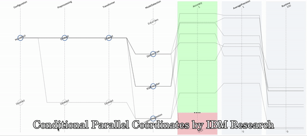

# Conditional Parallel Coordinates [#IBMResearch]( https://www.research.ibm.com/ )

Conditional Parallel Coordinates (CPC) are a generalization of the Parallel Coordinates visualization, where a categorical value on axes can be clicked, to expand another level of Parallel Coordinates on its behalf. The additionally revealed information is conditioned on the clicked value. CPC is implemented recursively, such that categorical values in sub-axes can again be expanded.

CPC's original use is in the area of Visualization of AI and machine learning pipelines, specifically to visualize pipeline steps, their respective hyperparameters, as well as resulting evaluation metrics simultaneously. However, there are too many other possible applications, so we do not want to withhold this from you.



##### Latest version: 1.0.5

##### Contact: daniel.karl@ibm.com

## Publications

- Daniel Karl I. Weidele. 2019. Conditional Parallel Coordinates. In 2019 IEEE Visualization Conference (VIS), 20-25 October, Vancouver, BC, Canada. IEEE. https://doi.org/10.1109/VISUAL.2019.8933632
- Daniel Karl I. Weidele, Justin D. Weisz, Eno Oduor, Michael Muller, Josh Andres, Alexander Gray and Dakuo Wang. 2020. AutoAIViz: Opening the Blackbox of Automated Artificial Intelligence with Conditional Parallel Coordinates. In 25th International Conference on Intelligent User Interfaces (IUI ’20), March 17–20, 2020, Cagliari, Italy. ACM, New York, NY, USA. https://doi.org/10.1145/3377325.3377538</li>

## Demo
```
npm install
npm start
```

## Users
### Default settings
```
// init CPC component (default settings)
let cpc:CPC = new CPC("my_dom_id", dataset);
```

### Custom settings
```
// init CPC component with custom settings
let config:CPCConfiguration = new CPCConfiguration();
config.rootCollapsible = false;
config.edgeRouting = true;
config.preferredPrecision = 3;
config.collapseOthersOnChoiceExpand = true;
config.deselectOthersOnLineSelect = true;
let cpc:CPC = new CPC("my_dom_id", dataset, config);
```

#### Configuration parameters

| Parameter | Type | default | Description | Since |
|---|---|---|---|---|
| rootCollapsible | bool | false | If true, visualization loads with a single choice, instead of expanded axes. | v1.0.0 |
| lineClickHandler | callback(e) | null | Callback, triggered when user selects a line. | v1.0.0 |
| preferredPrecision | int | 3 | Maximum number of decimals to display in labels. | v1.0.0 |
| edgeRouting | bool | true | If true, avoids intersections of polylines with expanded rectangles. | v1.0.0 |
| axisLabels | map | null | Override axis labels (*value*) by ID (*key*). | v1.0.0 |
| choiceLabels | map | null | Override choice labels (*value*) by ID (*key*). | v1.0.0 |
| collapseOthersOnChoiceExpand | bool | true | When user expands a choice, other choices are collapsed automatically. | v1.0.0 |
| deselectOthersOnLineSelect | bool | true | When user selects line, other lines are deselected automatically. | v1.0.0 |

## Developers

### Build
```
npm install
npm run build
```

### Package
```
npm run build:package
```

### Publish
```
npm version patch
npm publish
```
